# Bitcoin On-Chain Analytics (2017-2026)

Full ETL pipeline and OLAP analysis of Bitcoin's UTXO system, fee dynamics, and quantitative momentum signals during the modern exchange era. Built with Bitcoin Core, Parquet, ClickHouse, and Python/JupyterLab.

## Phases

Phase 1 - UTXO Analysis: Value distribution, age cohorts, script evolution. Done.
Phase 2 - Fees Over Time: Daily fees, moving averages, halving impact. Done.
Phase 3 - Momentum Signal: Fee Z-Score, price divergence, regime detection. Done.
Phase 4 - Mempool Heatmap Dashboard. Done.
Phase 5 - LightGBM Fees Prediction Model. Done.
Phase 6 - Entity Clustering. Done.
Phase 7 - LightGBM Trading Bot. Done.
Phase 8 - Apache Superset Unified Dashboard. Pending.

## System Architecture

Four-layer ETL pipeline with zero data duplication. Bitcoin Core with txindex=1 serves as source of truth. ClickHouse reads Parquet files directly via File engine. No import step, no data duplication, no extra storage.

Layer 1 (capa1_btccore_parquet): Raw blockchain data via RPC — blocks, transactions, inputs, outputs. Partitioned by block height in 250-block batches.

Layer 2 (capa2_utxo_parquet): Normalized UTXO events. Every output becomes a create event, every input becomes a spend event.

Layer 3 (capa3_block_metrics): Pre-computed block-level metrics. Fees calculated as coinbase outputs minus block subsidy. Eliminates expensive JOINs.

Layer 4 (capa4_binance): BTC/USDT price data from Binance API. 1-minute and 1-day candles with derived metrics (returns, volatility, VWAP).

Stack: Bitcoin Core RPC + Binance API to Python ETL to Parquet (zstd) to ClickHouse File Engine to JupyterLab (pandas, matplotlib).

Design decisions: 250 units per batch. zstd compression level 6. State JSON files for pause/resume. Menu-driven ETL (1=reset, 2=continue, 3=rollback). ClickHouse reads Parquet from user_files symlinks. Zero data duplication.

## ETL Pipeline

etl/capa1_btccore_parquet.py — Extracts on-chain data from Bitcoin Core RPC. 948,312 blocks processed (heights 0 to 948,069).

etl/capa2_utxo_parquet.py — Normalizes UTXO create/spend events from Capa 1. 7.08 billion events.

etl/capa3_block_metrics.py — Calculates fees and subsidy per block. 301,789 BTC total fees identified.

etl/capa4_binance.py — Downloads BTC/USDT from Binance API. 4.58M 1m candles, 3,185 daily candles.

Features: Automatic retries with exponential backoff. Reorg detection and safe rollback. tqdm progress bars. State machine architecture.

## Phase 1 - UTXO Analysis

Notebook: notebooks/01_exploracion_utxo.ipynb

Comprehensive UTXO system structure analysis. Value distribution, age cohort behavior, script type evolution, outlier patterns.

Key findings: Heavy-tail distribution spanning 10 orders of magnitude. 5-10 year cohorts hold majority supply. Zero correlation between value and age. Clear Legacy to SegWit to Taproot progression. Institutional consolidations visible in top 0.1% outliers.

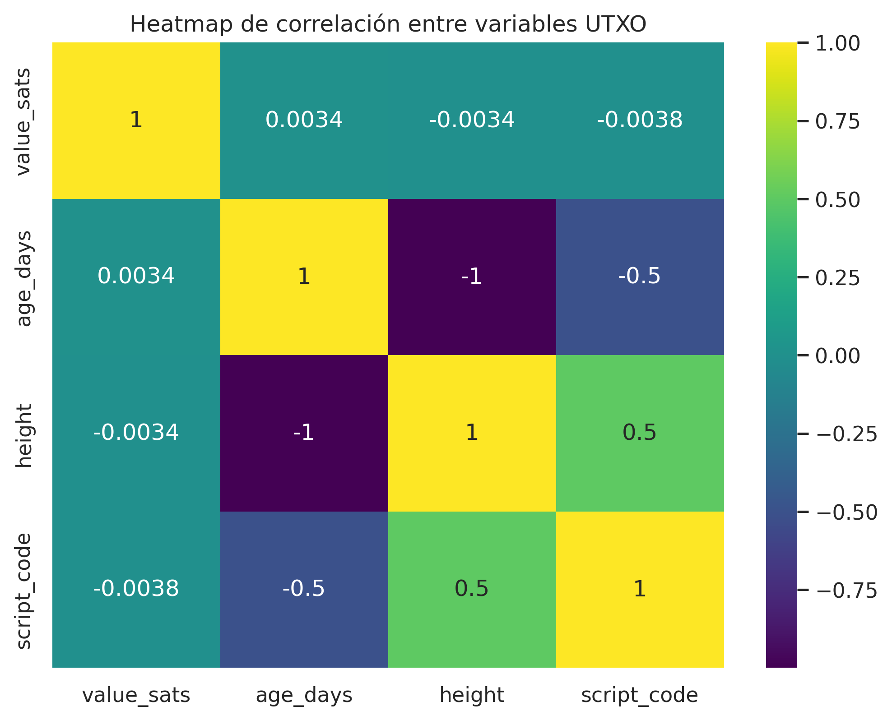

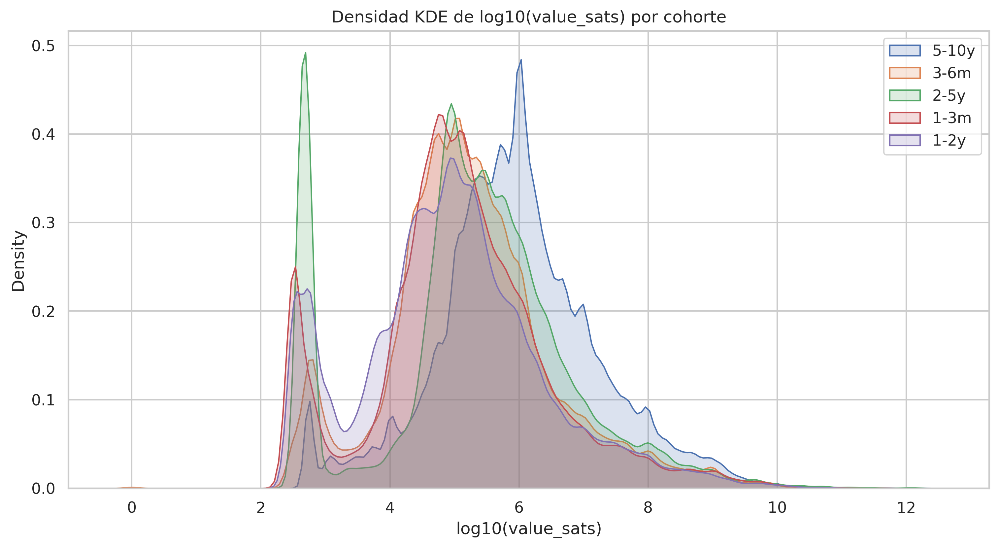

## Phase 2 - Fees Over Time (Binance Era)

Notebook: notebooks/02_fees_over_time.ipynb

Temporal fee analysis from Binance launch (July 14, 2017) through May 2026. 3,218 days. 192,552 BTC total fees.

Key metrics: Mean 59.84 BTC/day. Median 23.04 BTC/day. Max 1,369.48 BTC (Dec 22, 2017). Halving 2024: 861.14 BTC (#5 all-time).

Top 10 fee days: 9 of 10 during Dec 2017-Jan 2018 bull peak. April 20, 2024 halving breaks 2017 monopoly at #5.

Key findings: 2017 dominance with heavy-tail confirmed (mean 2.6x median). MA30 reveals 4-year cyclical patterns. Post-2024 fees structurally elevated.

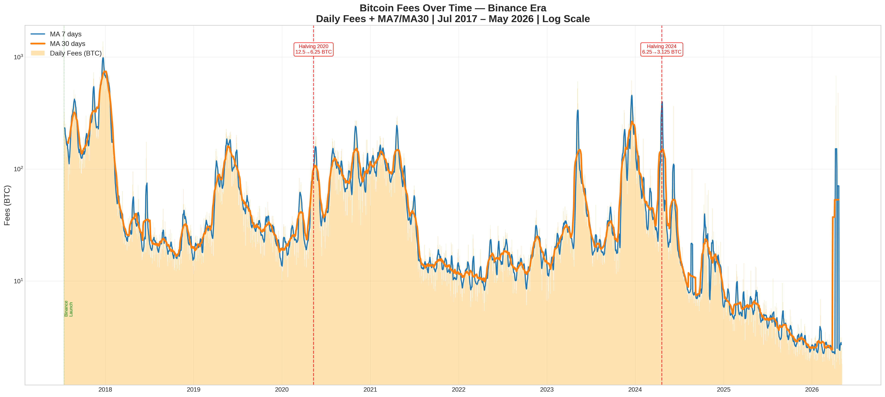
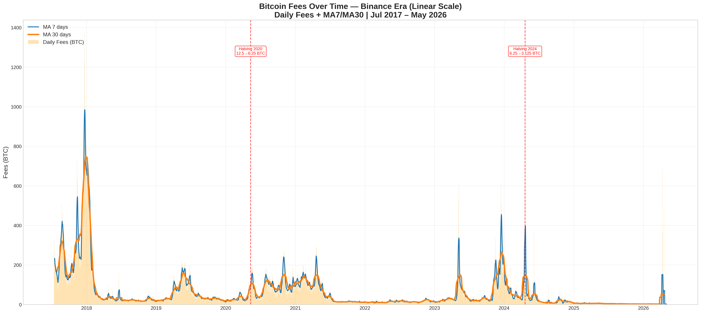
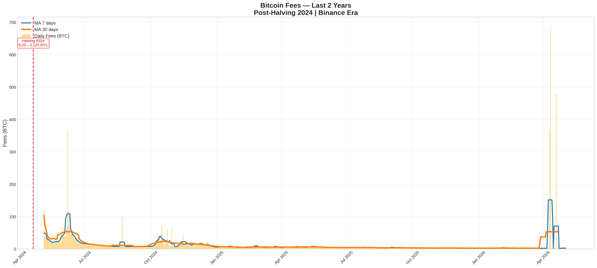

## Phase 3 - Quantitative Momentum Signal

Notebook: notebooks/03_momentum_signal.ipynb

Z-Score based momentum signal using on-chain fees and BTC price. 30-day rolling window with MA7 smoothing. Regime classification: elevated, normal, depressed.

Key metrics: 148 elevated streaks detected across 3,185 days. Signal threshold at Z > 1.5 for elevated, Z < -1.5 for depressed.

Top 10 strongest signals:
1. Apr 10, 2026 — Z=5.29 (post-halving 2026)
2. Aug 22, 2024 — Z=5.28 (summer fee spike)
3. Jun 7, 2024 — Z=5.16 (post-halving demand)
4. Jun 19, 2018 — Z=5.06 (bear market bounce)
5. Feb 23, 2025 — Z=4.94 (correction low)
6. Apr 19, 2024 — Z=4.87 (halving eve)
7. May 7, 2023 — Z=4.72 (Ordinals peak)
8. Apr 24, 2018 — Z=4.68 (bear rally)
9. Apr 11, 2026 — Z=4.64 (halving 2026)
10. Apr 30, 2020 — Z=4.64 (pre-halving 2020)

Key findings: All 3 halvings detected with Z > 4.5. Longest streak: 14 days during Ordinals 2023. Fee/Price divergence identifies demand-leading vs speculation-leading regimes.

Actionable thresholds: Z > +2 exhaustion (sell), Z < -2 accumulation (buy), Z between -1.5 and +1.5 normal (hold).

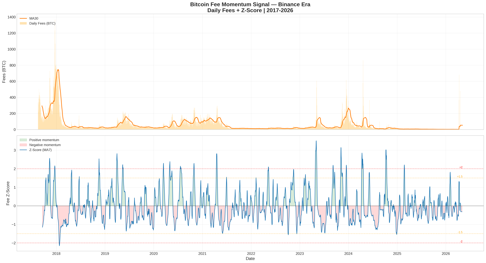
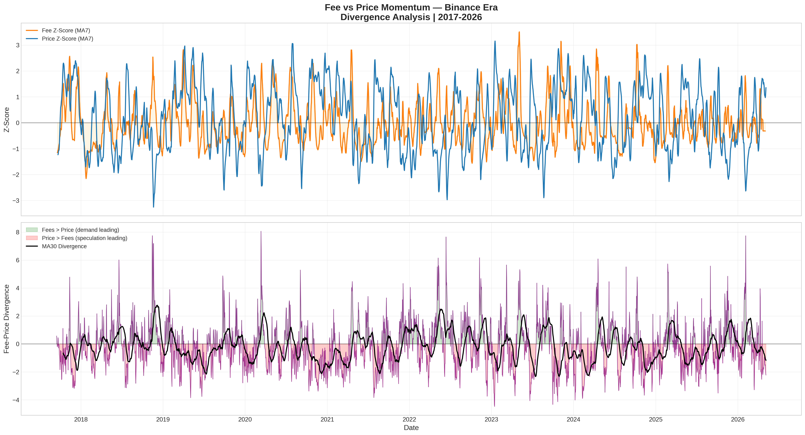

## Phase 4 - Mempool Heatmap Dashboard

Notebook: notebooks/04_mempool_heatmap.ipynb

Fee congestion heatmap using on-chain confirmed fees as mempool proxy. Analyzes fee patterns by hour of day and day of week across 4 market regimes.

Key metrics: 472,563 blocks analyzed across 4 market cycles. Top slot: Friday 11:00 UTC (0.56 BTC avg fees). Cheapest: Sunday 00:00-06:00 UTC (0.27 BTC avg). Weekend savings: approximately 50% vs weekday peak.

Top 10 most congested time slots:

1. Fri 11:00 UTC - 0.56 BTC avg (2,911 blocks, 2,567 avg tx)

2. Fri 12:00 UTC - 0.55 BTC avg (2,771 blocks, 2,609 avg tx)

3. Thu 08:00 UTC - 0.55 BTC avg (2,743 blocks, 2,471 avg tx)

4. Fri 10:00 UTC - 0.54 BTC avg (2,813 blocks, 2,687 avg tx)

5. Fri 08:00 UTC - 0.54 BTC avg (2,772 blocks, 2,391 avg tx)

6. Thu 12:00 UTC - 0.54 BTC avg (2,814 blocks, 2,618 avg tx)

7. Thu 11:00 UTC - 0.53 BTC avg (2,823 blocks, 2,588 avg tx)

8. Thu 10:00 UTC - 0.53 BTC avg (2,702 blocks, 2,636 avg tx)

9. Wed 08:00 UTC - 0.53 BTC avg (2,659 blocks, 2,485 avg tx)

10. Fri 09:00 UTC - 0.53 BTC avg (2,751 blocks, 2,502 avg tx)

Key findings: Thursday-Friday dominate congestion (8 of top 10 slots). European morning/US open (08:00-12:00 UTC) consistently highest fees. Sunday is cheapest day. 2017-2018 shows extreme spikes while 2022-2023 shows compressed low fees. 2024-2026 elevated from Ordinals/Runes.

Trading insight: Cheapest window is Sunday 00:00-06:00 UTC. Most expensive is Thursday-Friday 08:00-12:00 UTC.

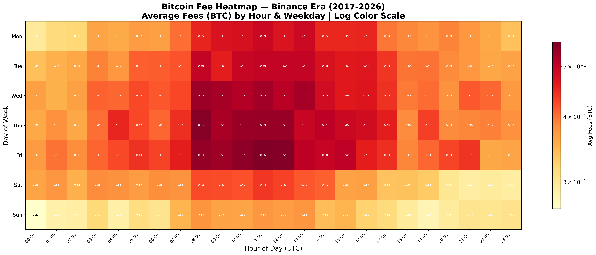

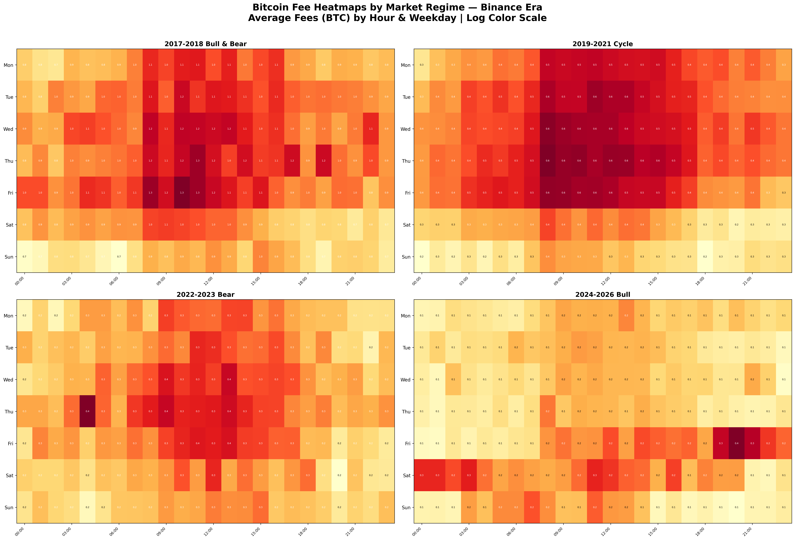

## Phase 5 - LightGBM Fee Prediction Model

Notebook: notebooks/05_fees_model.ipynb

Predicts next-day Bitcoin fees using LightGBM with 17 on-chain and market features. Log-transform strategy handles heavy-tail distribution. Two-tier approach: regression for normal days + Phase 3 Z-Score alert for extreme days.

Model performance (5-fold CV, normal days <100 BTC): MAE 6.82 BTC, R2 0.626. Top features: day_of_week (531), fees_log (521), log_return (424), fees_zscore from Phase 3 (351). Mean residual -0.14 BTC (nearly unbiased).

Key findings: Log transform improved R2 from -1.09 to 0.626. Day-of-week is #1 predictor, confirming Phase 4 heatmap. Phase 3 Z-Score validated as predictive feature (#6). Market features (log_return, volatility) add significant predictive power. Model ready for integration with Phase 7 trading bot.

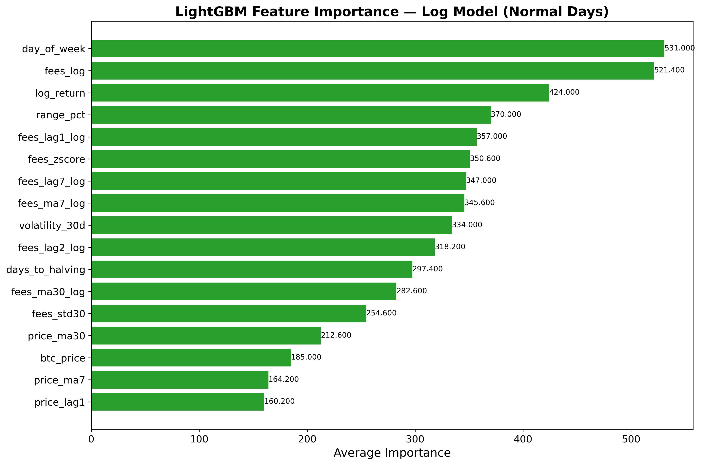

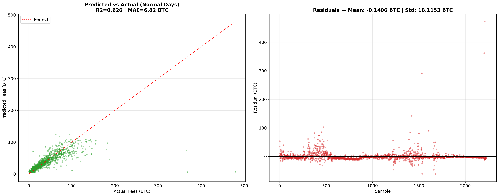

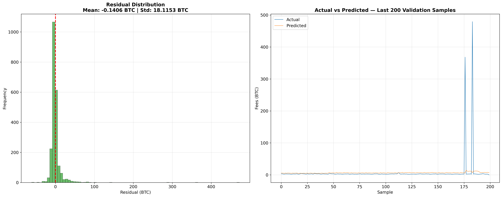

## Phase 6 - Entity Clustering (Market Regimes)

Notebook: notebooks/06_entity_clustering.ipynb

Unsupervised clustering of market regimes using HDBSCAN on 5 normalized features: log(fees), log(price), volatility, log_return, range_pct. 3,185 days analyzed.

Results: HDBSCAN discovered 2 natural clusters + outliers without predefined rules. Cluster 0 (1,234 days): high-price regime, avg BTC $59,755, fees 20.56 BTC, Nov 2020-May 2026. Cluster 1 (534 days): low-price regime, avg BTC $7,995, fees 36.65 BTC, Nov 2017-Nov 2020. Outliers: 1,417 days (44.5%) — no normal state exists.

Key findings: Algorithm found BTC $10K breakout (Nov 2020) as natural boundary between two eras. 44.5% days are outliers — Bitcoin has no normal state, validating Phase 3 Z-Score approach. Structural fee shift confirmed: modern era has 7.5x higher prices but 43% lower fees (SegWit + batching). PCA captures 62% variance in first 2 components.

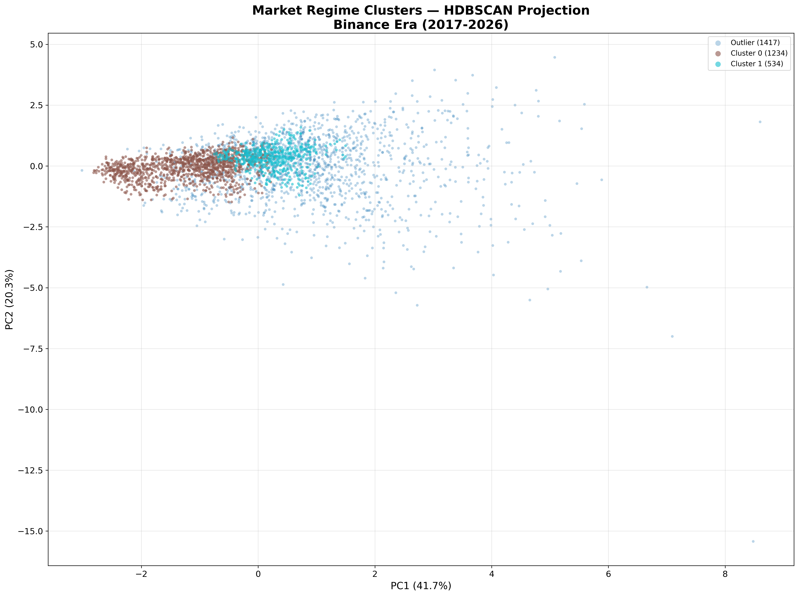

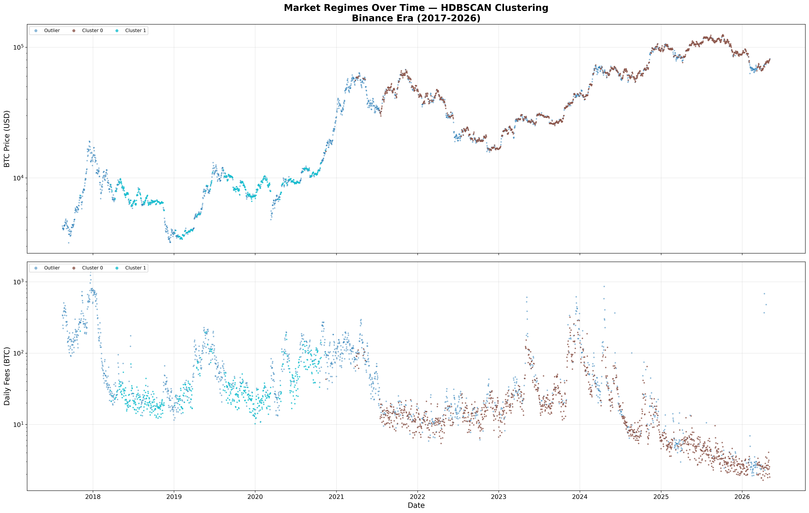

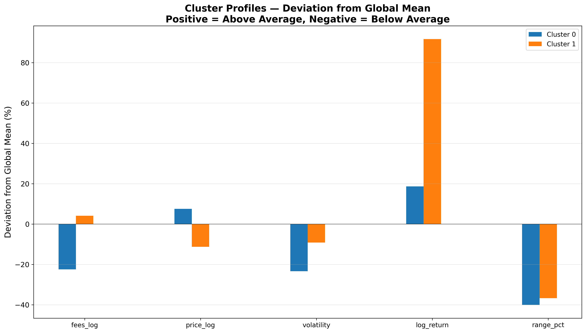

## Repository Structure

btc-etl/ with etl/ (4 Python scripts + bot/ with 4 Python modules), notebooks/ (6 Jupyter notebooks + images/ with 18 PNGs), parquet/ (4 capa directories, gitignored), state JSON files (gitignored), logs/ (gitignored), config/, venvetl/, venvquant/, README.md.

## Phase 7 - LightGBM Trading Bot v3

Directory: bot/ (train.py, config.py, data.py, features.py, live.py, paper_trader.py)

1H timeframe trading bot using LightGBM with 24 features: price action, technical analysis (RSI, MACD, Bollinger Bands, ATR, SMA crosses), on-chain Z-Score from Phase 3, and temporal features. Walk-forward backtesting across 9 periods with model retrained every 6 months.

Walk-Forward Results (1H candles, size=1.5%, dynamic ATR-based SL, 9 periods): ALL PERIODS PROFITABLE. Total Return +15.85%. Win Rate 53.8%. Profit Factor 1.82. Sharpe 22.1. Sortino 68.0. Max Drawdown -0.06%. Expectancy +0.077% per trade. 12,806 trades.

Technical Analysis Impact: RSI ranks #2 feature importance (390). Bollinger position #4 (360). MACD histogram #8 (307). All 9 walk-forward periods re-train on prior 6 months, test out-of-sample. Zero data leakage.

Live Trading: WebSocket connection to Binance (public, no API key). Predicts LONG/WAIT every hour with confidence score, Z-Score, and RSI. Paper trader simulates P&L with $10,000 virtual capital.

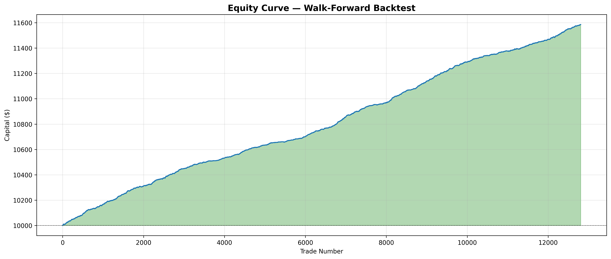

Start ClickHouse from /media/SSD4T/clickhouse. Run ETL scripts with venvetl (options 1/2/3). Launch JupyterLab with venvquant. ClickHouse tables use File(Parquet) engine via user_files/ symlinks.

Built by Byron. Stack: Bitcoin Core + Binance API to Python ETL to Parquet (zstd) to ClickHouse File Engine to JupyterLab (pandas, matplotlib).

## License

MIT License — see [LICENSE](LICENSE) file for details.

Copyright (c) 2025-2026 Byron
