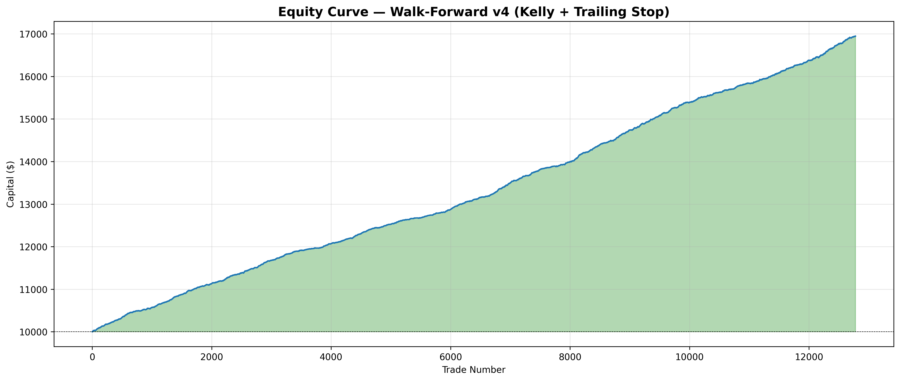

# Bitcoin On-Chain Analytics (2017-2026)

Full ETL pipeline and OLAP analysis of Bitcoin's UTXO system, fee dynamics, and quantitative momentum signals during the modern exchange era. Built with Bitcoin Core, Parquet, ClickHouse, and Python/JupyterLab.

## Phases

Phase 1 — UTXO Analysis: Value distribution, age cohorts, script evolution. Done.
Phase 2 — Fees Over Time: Daily fees, moving averages, halving impact. Done.
Phase 3 — Momentum Signal: Fee Z-Score, price divergence, regime detection. Done.
Phase 4 — Mempool Heatmap: Fee congestion by hour and weekday. Done.
Phase 5 — LightGBM Fee Prediction: Next-day fees with R2=0.626. Done.
Phase 6 — Entity Clustering: HDBSCAN market regime discovery. Done.
Phase 7 — Trading Bot: LightGBM 1H bot with on-chain alpha. Done.
Phase 8 — Apache Superset Dashboard. Pending.

## System Architecture

Four-layer ETL pipeline with zero data duplication. Bitcoin Core with txindex=1 extracts raw blockchain data. ClickHouse reads Parquet files directly via File engine — no import step, no extra storage.

Layer 1 (capa1_btccore_parquet): Blocks, transactions, inputs, outputs. 948,312 blocks processed from height 0 to 948,069.

Layer 2 (capa2_utxo_parquet): Normalized UTXO events. 7.08 billion create/spend events.

Layer 3 (capa3_block_metrics): Pre-computed fees = coinbase outputs minus block subsidy. 301,789 BTC total fees identified.

Layer 4 (capa4_binance): BTC/USDT from Binance API. 4.58M 1m candles, 3,185 daily candles.

Stack: Bitcoin Core RPC + Binance API to Python ETL to Parquet (zstd) to ClickHouse File Engine to JupyterLab (pandas, matplotlib). State JSON files for pause/resume. Menu-driven ETL (1=reset, 2=continue, 3=rollback). 250-unit batches. Zero duplication.

## Phase 1 — UTXO Analysis

Notebook: notebooks/01_exploracion_utxo.ipynb

Heavy-tail value distribution spanning 10 orders of magnitude. 5-10 year cohorts hold majority supply. Zero correlation between UTXO value and age. Clear Legacy to SegWit to Taproot progression. Institutional consolidations in top 0.1% outliers.

## Phase 2 — Fees Over Time (Binance Era)

Notebook: notebooks/02_fees_over_time.ipynb

3,218 days analyzed from July 2017 to May 2026. 192,552 BTC total fees. Mean 59.84 BTC/day. Median 23.04 BTC/day. Max 1,369.48 BTC on December 22, 2017. Halving 2024: 861.14 BTC ranked number 5 all-time. 9 of top 10 fee days during December 2017 to January 2018 bull peak. MA30 reveals 4-year cyclical patterns. Post-2024 fees structurally elevated.

## Phase 3 — Quantitative Momentum Signal

Notebook: notebooks/03_momentum_signal.ipynb

Z-Score momentum using on-chain fees and BTC price. 30-day rolling window with MA7 smoothing. 148 elevated streaks detected. All 3 halvings detected with Z greater than 4.5. Longest streak: 14 days during Ordinals 2023. Thresholds: Z above +2 exhaustion, Z below -2 accumulation, between -1.5 and +1.5 normal.

## Phase 4 — Mempool Heatmap

Notebook: notebooks/04_mempool_heatmap.ipynb

472,563 blocks analyzed. Peak: Friday 11:00 UTC at 0.56 BTC average fees. Cheapest: Sunday 00:00 to 06:00 UTC at 0.27 BTC. Weekend savings approximately 50 percent. Thursday and Friday dominate congestion with 8 of top 10 slots.

## Phase 5 — LightGBM Fee Prediction

Notebook: notebooks/05_fees_model.ipynb

Next-day fee prediction with log-transform. 5-fold cross-validation: MAE 6.82 BTC, R2 0.626. Top features: day_of_week (531), fees_log (521), fees_zscore from Phase 3 (351). Two-tier approach: regression for normal days plus Z-Score alert for extreme days.

## Phase 6 — Entity Clustering

Notebook: notebooks/06_entity_clustering.ipynb

HDBSCAN on 5 features discovered 2 natural clusters plus 44.5 percent outliers. Cluster 0: high-price regime, average BTC 59,755 dollars, November 2020 to May 2026. Cluster 1: low-price regime, average BTC 7,995 dollars, November 2017 to November 2020. Boundary at 10,000 dollar breakout in November 2020.

## Phase 7 — LightGBM Trading Bot v4

Directory: bot/ — Full documentation at bot/README.md

1H timeframe trading bot with 26 features: price action, technical analysis (RSI, MACD, Bollinger Bands, ATR, SMA crosses, Funding Rate), on-chain Z-Score from Phase 3, and temporal features. Walk-forward backtesting across 9 periods with model retrained every 6 months. Kelly sizing plus trailing stop plus max daily loss.

Results: +69.74 percent total return over 4.5 years. 12,806 trades. Win rate 53.8 percent. Profit factor 2.02. Sharpe 26.4. Sortino 94.7. Max drawdown -0.14 percent. Expectancy +0.103 percent per trade. Average win +0.38 percent. Average loss -0.22 percent. All 9 periods profitable.

## Repository Structure

btc-etl/ contains etl/ with 4 ETL scripts, notebooks/ with 6 Jupyter notebooks and images/ with 19 PNGs, bot/ with 6 Python files and README, models/ with trained LightGBM files (gitignored), parquet/ with 4 capa directories (gitignored), state JSON files (gitignored), logs/ (gitignored), venvetl/ and venvquant/ virtual environments, README.md, and LICENSE.

## Quick Start

Start ClickHouse from /media/SSD4T/clickhouse. Run ETL scripts with venvetl environment using menu options 1 for reset, 2 for continue, or 3 for rollback. Launch JupyterLab with venvquant environment. ClickHouse tables use File(Parquet) engine via user_files/ symlinks. Train bot with python bot/train.py. Run live signals with python bot/live.py.

Built by Byron. Stack: Bitcoin Core + Binance API to Python ETL to Parquet with zstd to ClickHouse File Engine to JupyterLab with pandas and matplotlib.

## License

MIT License — see LICENSE file for details. Copyright (c) 2025-2026 Byron.
